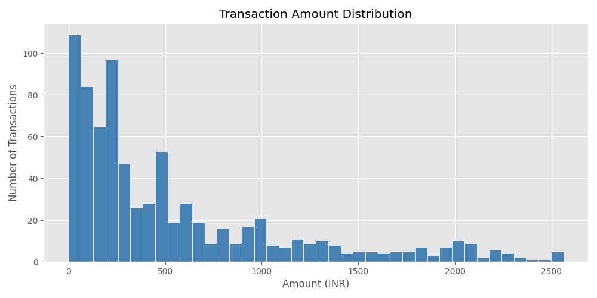
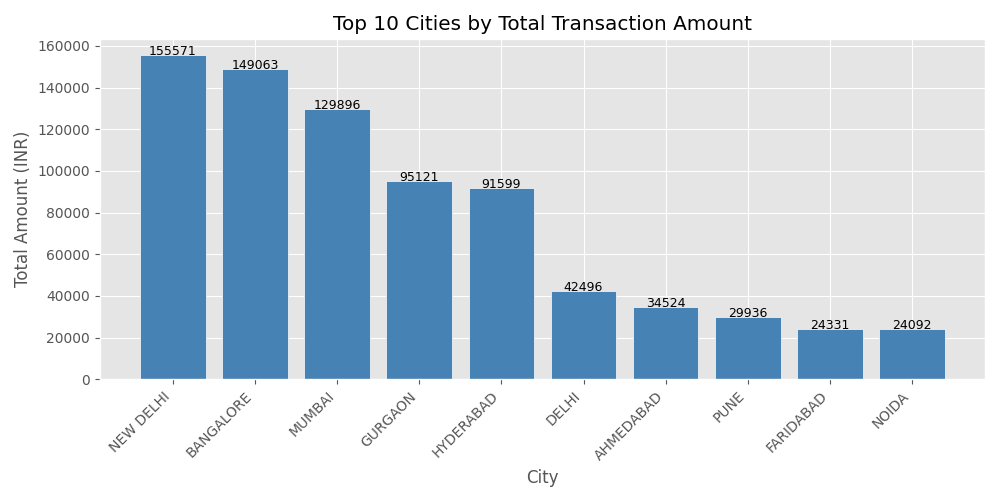
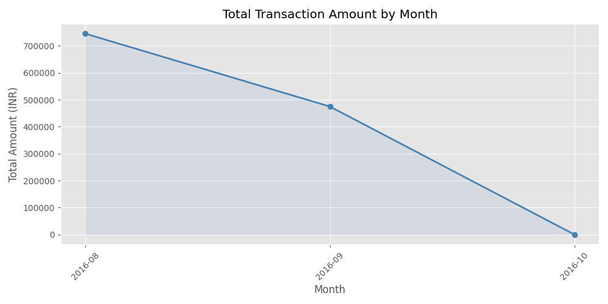
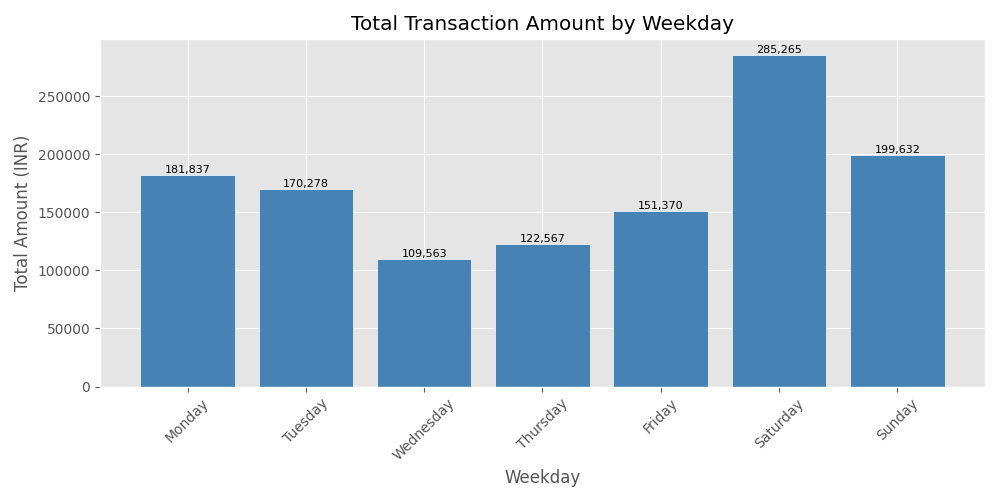
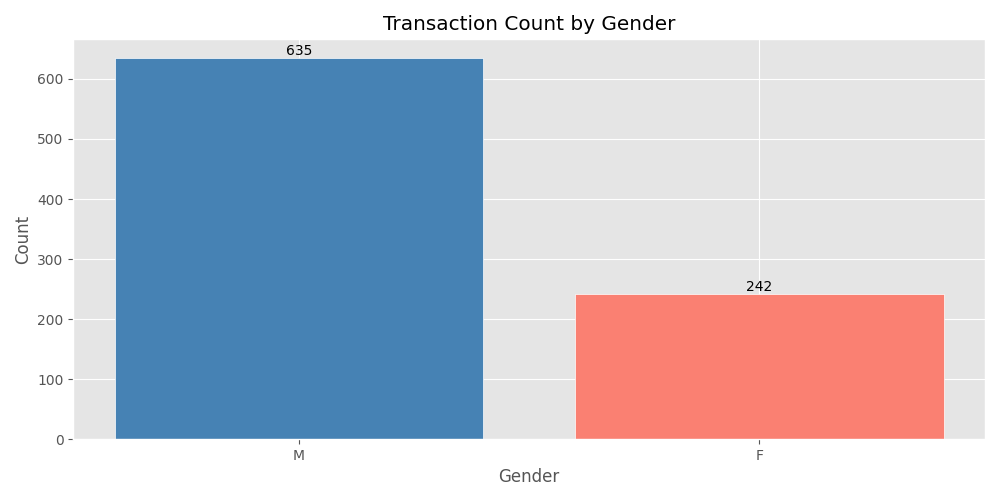
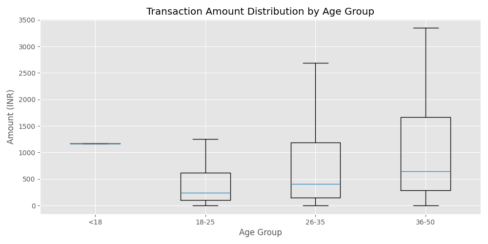
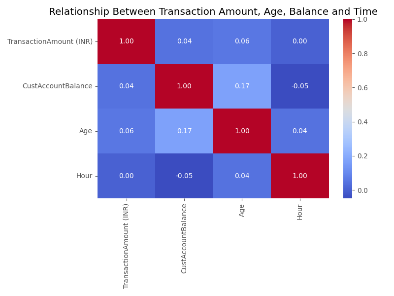
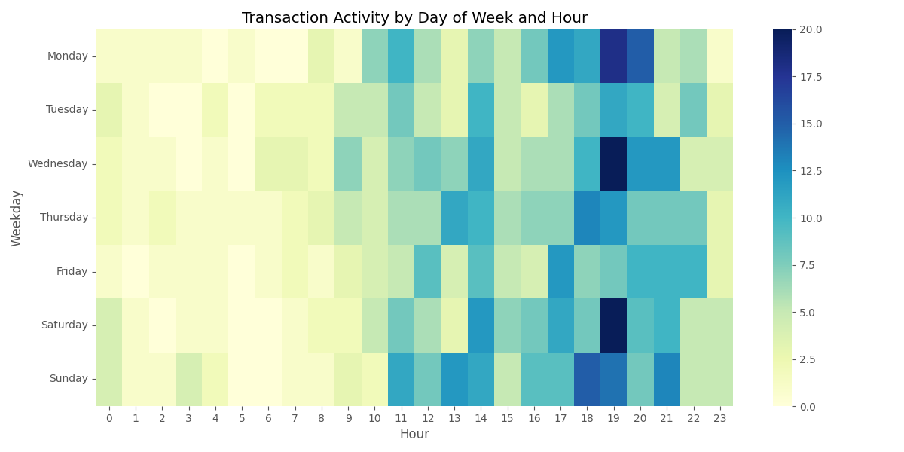
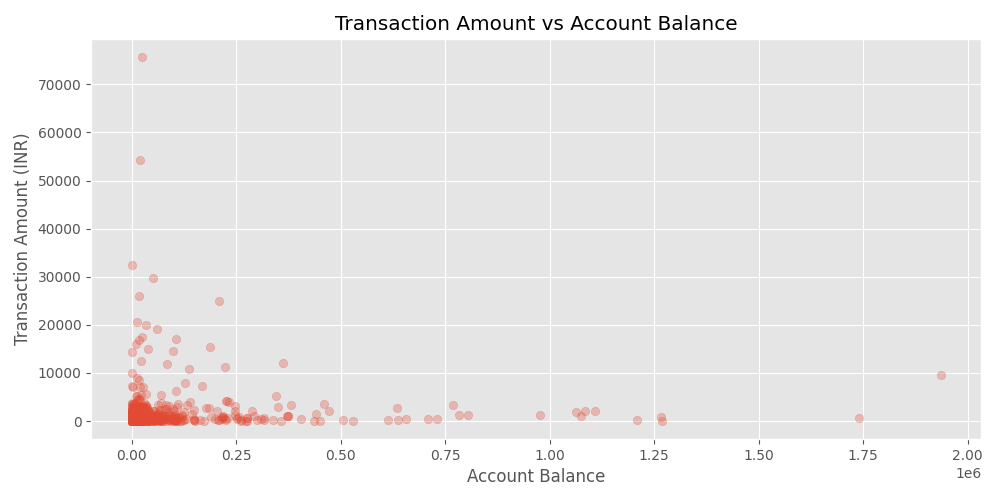

# transaction-risk-analysis
## Project Overview
This project explores bank transaction data to identify patterns in customer behavior, transaction activity, and potential anomalies.
The goal of this analysis is to better understand how users interact with financial systems by examining transaction amounts, time patterns, demographics, and locations.

## Dataset
This project uses transaction data from the following Kaggle dataset:
https://www.kaggle.com/datasets/shivamb/bank-customer-segmentation 
Only a subset of the original dataset is included in this repository.
The dataset is used for educational and portfolio purposes only.
All rights to the data belong to the original authors.
Note: The repository contains only a sample of the dataset to keep the project lightweight.

---

## Tools & Technologies
- Python
- pandas
- matplotlib
- seaborn

---

## Analysis Steps
- Loaded and explored the dataset
- Cleaned the data:
  - removed duplicates
  - handled missing values
  - converted date and time columns
- Created new features:
  - Age
  - AgeGroup
  - Month
  - Weekday
  - Hour
- Detected outliers using the IQR method
- Performed exploratory data analysis (EDA)
- Built visualizations to understand patterns

---

## Key Insights
- Most transactions are relatively small, with a few large outliers (right-skewed distribution).
- Transaction activity varies across weekdays, indicating behavioral patterns during the week.
- Certain cities contribute a significantly larger share of total transaction volume.
- Transaction activity depends on the time of day, with noticeable peaks during specific hours.
- The relationship between account balance and transaction amount appears weak.

---

## Visualizations
### Transaction Amount Distribution


### Top Cities by Transaction Volume


### Monthly Transaction Trend


### Activity by Weekday


### Transaction Count by Gender


### Transaction Amount by Age Group


### Correlation Matrix


### Activity by Weekday and Hour


### Amount vs Balance


---

## How to Run
Install dependencies:
```bash
pip install -r requirements.txt
```
Run the script:
```bash
python sample.py
```
---

## Notes
This project was created as a portfolio project to demonstrate:
- data cleaning
- feature engineering
- exploratory data analysis
- data visualization
- ability to extract insights from real-world data


